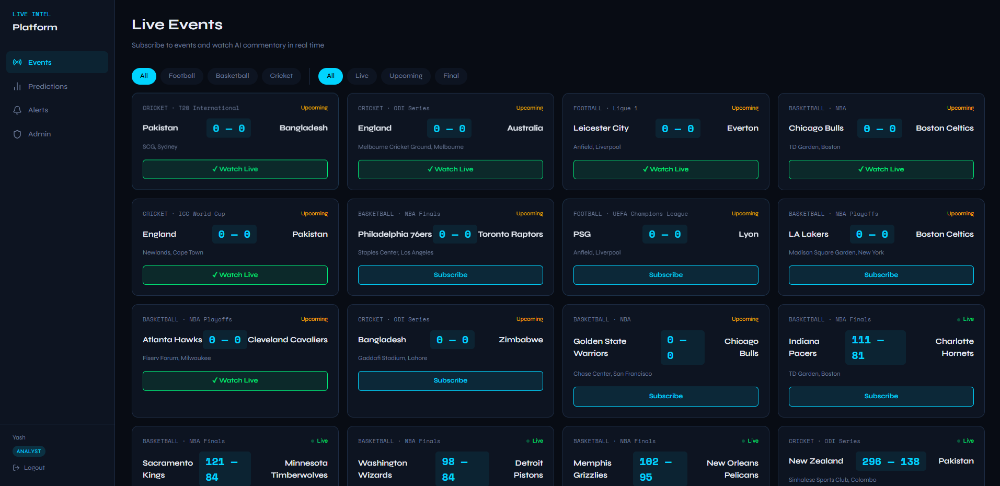

# 🚀 Live Event Intelligence Platform

## 🧭 Project Overview
Live Event Intelligence is a real-time sports analytics platform that ingests live match data, runs multi-stage AI pipelines, and streams commentary, analysis, alerts, and post-match reports to connected clients.

Deployment: https://live-event-intelligence.onrender.com

## 🧱 Architecture (ASCII)
```
                        +-------------------------+
                        |  External Sports API    |
                        |  (TheSportsDB)          |
                        +-----------+-------------+
                                    |
                                    v
+------------------+       +--------+---------+       +------------------------+
|  Scheduler (API) |-----> |  Worker API      |-----> |  BullMQ Queues          |
|  APScheduler     |       |  (Express)       |       |  ingest / analysis ...  |
+---------+--------+       +--------+---------+       +-----------+------------+
          |                         |                             |
          |                         v                             v
          |                +--------+---------+        +-----------+------------+
          |                |  Workers          |        |  MongoDB Atlas         |
          |                |  Groq / Gemini    |        |  Events + Analytics    |
          |                +--------+---------+        +-----------+------------+
          |                         |                             |
          |                         v                             |
          |               +---------+---------+                   |
          |               |  WebSocket Hub    |<------------------+
          |               |  /ws/events/{id}  |
          |               +---------+---------+
          |                         |
          v                         v
+---------+---------+     +---------+---------+
|  REST API         |<--->|  Frontend (Vite)  |
|  FastAPI          |     |  Live Dashboard   |
+-------------------+     +-------------------+
```

## ✅ Prerequisites
- Python 3.11+ and pip
- Node.js 18+ and npm
- MongoDB Atlas account
- Upstash Redis account
- TheSportsDB API key
- Groq API key
- Google AI (Gemini) API key

## 🔐 Environment Variables
Create the following files:

### Backend (.env in backend/)
- `APP_NAME`: API title (default: Live Event Intelligence Platform)
- `APP_VERSION`: API version string
- `DEBUG`: true/false for debug mode
- `SECRET_KEY`: JWT signing secret
- `JWT_ALGORITHM`: JWT algorithm (default: HS256)
- `ACCESS_TOKEN_EXPIRE_MINUTES`: token TTL in minutes
- `MONGODB_URI`: MongoDB Atlas connection string
- `MONGODB_DB_NAME`: database name
- `UPSTASH_REDIS_REST_URL`: Upstash REST URL
- `UPSTASH_REDIS_REST_TOKEN`: Upstash REST token
- `REDIS_URL`: Redis connection string (TLS)
- `GROQ_API_KEY`: Groq API key
- `GEMINI_API_KEY`: Gemini API key
- `SPORTS_DB_API_KEY`: TheSportsDB API key
- `SPORTS_DB_BASE_URL`: TheSportsDB base URL
- `USE_MOCK`: true to use mock_livescore.json
- `FRONTEND_URL`: allowed CORS origin

Reference: [backend/.env.example](backend/.env.example)

### Frontend (.env in frontend/)
- `VITE_API_BASE_URL`: REST API base URL (no trailing slash)
- `VITE_WS_BASE_URL`: WebSocket base URL (`ws://` or `wss://`)

Reference: [frontend/.env.example](frontend/.env.example)

### Workers (.env in workers/)
- `MONGODB_URI`: MongoDB Atlas connection string
- `MONGODB_DB_NAME`: database name
- `REDIS_URL`: Redis connection string (TLS)
- `GROQ_API_KEY`: Groq API key
- `GEMINI_API_KEY`: Gemini API key
- `FASTAPI_INTERNAL_URL`: FastAPI base URL for internal callbacks (e.g. http://localhost:8000)
- `BULL_BOARD_PORT`: Bull Board port (default: 3001)

## 🛠 Local Setup (Step-by-Step)
1) Clone the repository and open the root folder.
2) Backend
    ```
   - `cd backend`
   - `python -m venv .venv`
   - `.venv\Scripts\activate`
   - `pip install -r requirements.txt`
   - Create `backend/.env` from [backend/.env.example](backend/.env.example)
   - `uvicorn app.main:app --reload --port 8000`
   ```
3) Workers
    ```
   - `cd workers`
   - `npm install`
   - Create `workers/.env` (see variables above)
   - `npm run dev`
   ```
4) Frontend
    ```
   - `cd frontend`
   - `npm install`
   - Create `frontend/.env` from [frontend/.env.example](frontend/.env.example)
   - `npm run dev`
   ```
5) Open http://localhost:5173

## 🧪 Run with USE_MOCK=true
1) Set `USE_MOCK=true` in `backend/.env`.
2) Ensure [mock_livescore.json](mock_livescore.json) exists.
   - Optional refresh: `python generate_mock.py`
3) Start backend + workers + frontend.
4) The scheduler will ingest from mock data every 60 seconds.

## 📸 Screenshots
1. Landing Page

2. Events Page

3. WebSocket Test


## 🌟 Highlighted Features
- Multi-model debate view for predictions (Groq vs Gemini) with accuracy tracking.
- Operational retry panel to view and retry failed BullMQ jobs.

## 🧪 How to Test Highlighted Features
1) Multi-model debate view
   - Subscribe to at least one live event.
   - Navigate to the Prediction Board.
   - Verify side-by-side model predictions and accuracy stats.
2) Retry dashboard
   - Navigate to Admin -> Retry Dashboard.
   - Stop a worker to force a failure, then refresh the dashboard.
   - Click Retry on a failed job and verify status updates.

## 📚 API Documentation
- Local: http://localhost:8000/docs
- Deployed: https://live-event-intelligence.onrender.com

## 📁 Folder Structure
```
live-event-intelligence/
├─ backend/
│  ├─ app/
│  │  ├─ admin/
│  │  ├─ ai/
│  │  ├─ alerts/
│  │  ├─ auth/
│  │  ├─ events/
│  │  ├─ reports/
│  │  ├─ websocket/
│  │  ├─ config.py
│  │  ├─ database.py
│  │  └─ main.py
│  ├─ requirements.txt
│  └─ .env.example
├─ frontend/
│  ├─ src/
│  │  ├─ api/
│  │  ├─ components/
│  │  ├─ hooks/
│  │  ├─ pages/
│  │  └─ store/
│  ├─ public/
│  ├─ index.html
│  └─ package.json
├─ workers/
│  ├─ src/
│  │  ├─ workers/
│  │  ├─ queues.js
│  │  └─ index.js
│  └─ package.json
├─ generate_mock.py
├─ mock_livescore.json
└─ LICENSE.txt
```

## 📄 License
MIT License © Yash Dewangan


## 💬 Let's Connect
Feel free to connect or suggest improvements!
- Built by **Yash Dewangan**
- 🐙Github: [YashDewangan](https://github.com/yashdew3)
- 📧Email: [yashdew06@gmail.com](mailto:yashdew06@gmail.com)
- 🔗Linkedin: [YashDewangan](https://www.linkedin.com/in/yash-dewangan/)

## 🤝 Contributing
Contributions, issues, and feature requests are welcome! Feel free to check the [issues page](https://github.com/yashdew3/Live-Event-Intelligence-Commentary/issues) (if you have one) or open a new issue to discuss changes. Pull requests are also appreciated.